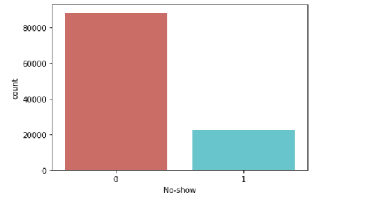

# Attending a Doctor's Appointment...or Not.

Author: James Stipanowich

## Project Overview

A doctor waits...and waits...AND waits...Where is the patient? Where are MULTIPLE patients? In every doctor's office around the globe there are instances when people miss doctor appointments. What is the reason? Does it have to do with the doctor's behavior? Is something wrong with the patient? Is a specific kind of person constantly missing their designated appointments? Is some event occurring to illicit an absence from a doctor's office? These are all questions to explore in determining why patients are missing at scheduled doctor appointments.

## Business Problem

In this project, I am acting with a doctor's office in a Brazilian neighborhood. The doctor's office expresses concern that patients are not showing up for their doctor appointments. I plan to help the doctor's office determine what factors caused patients to avoid scheduled doctor appointments and what types of patients are most likely to skip their scheduled doctor appointment. I desire to provide insight on how to eliminate potential "no-show" appointments.

## The Data

This project uses data from a Kaggle dataset about medical appointment "no-shows". The Medical Appointment No-Shows dataset can be found at https://www.kaggle.com/joniarroba/noshowappointments. The dataset covers the attendance records for doctor appointments in 81 neighborhoods in Brazil. There are 110527 rows of appointments in the dataset.

I decided what data columns from this dataset to use and how to use them. 

## Data Preparation

The classifier being predicted is whether a patient attended (0) or did not show up (1) for their doctor appointment. The records of each appointment scenario I graphed as follows with 88208 attended appointments and 22319 "no-show" appointments with the doctor's office:

I observed that about 80 percent of the appointments were attended and 20 percent of the appointments were "no-shows". 

I changed the "AppointmentDay" column to represent the day of the week for each appointment and added those values to a column with the title "DayoftheWeek". Also, I subtracted the "AppointmentDay" column from the "ScheduledDay" column and added a column titled "DayDifference" to represent how many days out the appointment was scheduled from the actual day the appointment was set to take place.

I created a new dataframe to contain all the columns I used in my analyses and looked at the data types of each column. Also, I grouped all of my analysis columns by the "No-show" column. I determined the average age for a "no-show" is 34.3 years old and the average number of days away from an appointment for a "no-show" to occur on the appointment day is 15.8 days.

I prepared my new dataframe for a train-test split and data modeling procedures.

## Data Modeling

After trying different models including logistic regression and k nearest neighbors, I chose to stick with a tree based model instead of some other model type. My focus was on getting an accurate model that had a lot of interaction terms.

I started off with a first decision tree classifier model that was very overfit. I decided to use this model to look at possible parameters for a parameter grid and produce another tree model to help improve model performance. I created graphs of max tree depth, minimum samples splits, and minimum samples for a leaf for my next tree model.

I instantiated a new tree-based model. However, that did not do well with the parameters I put into it. I put that model into random forest and grid search models to help prune my tree models further and come up with best parameters for my final tree-based model that used GridSearchCV.

My final model had very close accuracy scores for training and test data of both around 0.57 with the slightest bit of underfitting. The final model had an AUC of 0.7, which compares the false positive and true positive rates effectively. The trend in "no-shows" is starting to being identified more than previous models. The f1 score was best for my final model. I wanted to get fairly balanced precision and recall scores for my model. I would rather believe someone was not going to show up for an appointment and have them show up than believe a person was going to show up for an appointment and have them be a "no-show". Recall represents a minimization of false negatives.

I chose to look at the feature importances for my final tree-based model. Age, SMS_received, and DayDifference seemed to be the columns most influential in the results of the data. I decided to include permutation importance because feature importance does not reshuffle the features to create more balanced results. Permutation importance allows for preserving the distribution of the variable of each predictor that influences model performance. The Age, SMS_received, and DayDifference columns still seemed to be the columns that hold the most weight when analyzing the data.

## Conclusions

- Include age in future doctor office analyses. The Age column exhibited high logistic regression importance, random forest feature importance, and permutation importance. The average age of a "no-show" was lower than the average age of a person who attended an appointment.  Older people appear to attend appointments more often than younger people on average. The doctor's office might create incentives for younger patients to attend their appointments.

- Book less appointments farther out from the actual appointment day. The average number of days 
away from an appointment for a "no-show" was higher than the average number of days away from an appointment of someone who attended their appointment. The DayDifference column had high logistic regression importance, random forest feature importance, and permutation importance.

- Remind people more frequently of their appointment whether by phone or text. The DayDifference columns and SMS_received columns showed strong relationships with "no-shows". The DayDifference column and SMS _received columns had high logistic regression importance, random forest feature importance, and permutation importance. Appointment reminders could help decrease the number of "no-show" appointments and increase memory potential of a scheduled appointment before the appointment takes place. 

## Recommendations for Further Analysis

- Consider gender more in future analyses. Gender had slight logistic regression importance, random forest feature importance, and permutation importance.

- Procure a "no-show" analysis based on neighborhood. Some neighborhoods may have stronger correlations with "no-shows" than others.

- Locate and utilize data on what kind of medicine each doctor's office specializes in. A doctor's office specialization could provide interesting information and possible trends for no-show appointments.

## For More Information

See the full analysis of my findings in DoctorsAppointment.ipynb

Contact me at jmstipanowich@gmail.com

## Repository Structure

├── images

├── DoctorNoShowPowerpoint1.pdf

├── DoctorsAppointment.ipynb

├── README.md